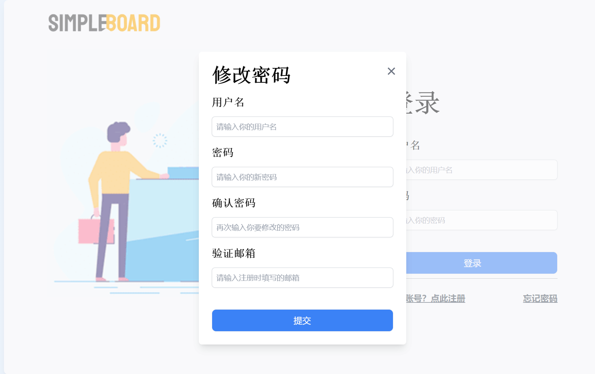
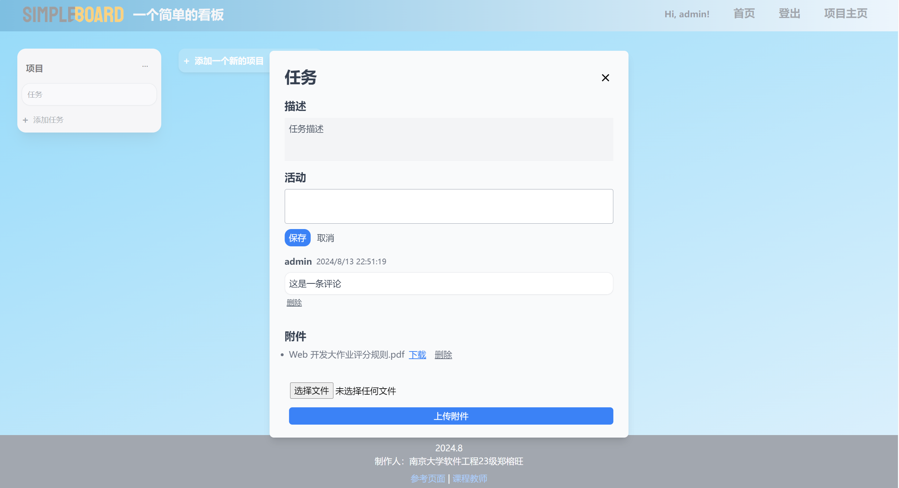
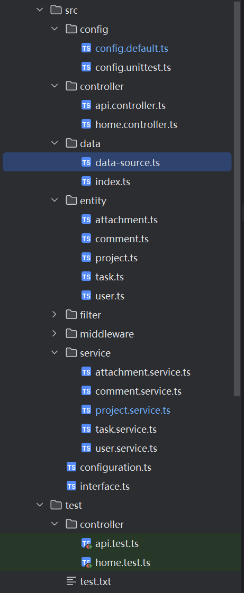

# SimpleBoard
## Github项目地址：

```
https://github.com/zzzrw/SimpleBoard
```

## 运行方式：

前端：

安装依赖后，启动开发服务器

端口号为5173（若未被占用)

`http://localhost:5173/`

```bash
cd frontend
npm install
npm run dev
```

后端：

安装依赖后，使用pm2启动并管理进程

后端端口为7001

`http://127.0.0.1:7001`

```bash
cd backend
npm install
pm2 start
```

或用`npm run dev` 或`npm start`启动服务器

## 功能说明：

### 前端界面

- 账号注册

- 找回密码

  

- 附件下载

- 

### 后端技术：

- 使用了sqlite数据库，利用orm进行数据源的配置

```ts
import {DataSource} from "typeorm";
import {User} from "../entity/user";
import {Project} from "../entity/project";
import {Task} from "../entity/task";
import {Comment} from "../entity/comment";
import {Attachment} from "../entity/attachment";

export const AppDataSource = new DataSource({
  type: 'sqlite',
  database: '../../data/db.sqlite',
  entities: [User, Project, Task, Comment, Attachment],
  synchronize: true,
  logging: false
});
```

- 结构展示



## 应用概述

本次项目的敏捷看板应用，我主要参照trello进行前端ui的设计

尽量让页面整洁美观，同时让用户交互比较清晰、便利

前端主要遵循SPA模式，利用react-router-dom进行路由管理

网页ui使用了导航栏+页脚信息

利用AuthContext进行用户登录状态管理

利用tailwindcss进行样式渲染

axios进行前后端通信

后端配置了数据库，创建用户、项目、任务、评论、附件这些实体进行管理

在api.controller.ts以及service目录下进行配置

能够完成对上述实体对应数据库信息的增删查改等操作

接受前端信息并返回内容
